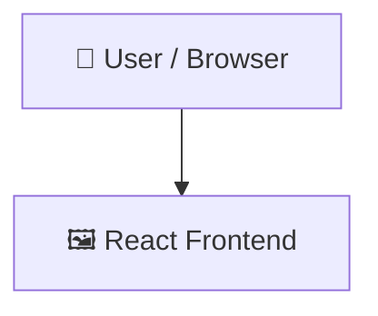

# LEARNBYAI

   

## 📑 Table of Contents

- [Description](#description)
- [Tech Stack](#tech-stack)
- [Architecture](#architecture)
- [Quick Start](#quick-start)
- [Key Dependencies](#key-dependencies)
- [Available Scripts](#available-scripts)
- [Project Structure](#project-structure)
- [Development Setup](#development-setup)
- [Contributors](#contributors)
- [Contributing](#contributing)

## 📝 Description

LEARNBYAI — a frontend web app built with JavaScript, React, Tailwind CSS, Vite.

## 🛠️ Tech Stack

   

## 🏗️ Architecture

A high-level view of how the main pieces fit together:



## ⚡ Quick Start

```bash

# 1. Clone the repository
git clone https://github.com/Garv978/LEARNBYAI.git

# 2. Install dependencies
npm install

# 3. Start the dev server
npm run dev
```

## 📦 Key Dependencies

```
@tailwindcss/vite: ^4.3.2
axios: ^1.18.1
jwt-decode: ^4.0.0
lucide-react: ^1.24.0
react: ^19.2.7
react-dom: ^19.2.7
react-router-dom: ^7.18.1
tailwindcss: ^4.3.2
```

## 🚀 Available Scripts

- **dev** — `npm run dev`
- **build** — `npm run build`
- **lint** — `npm run lint`
- **preview** — `npm run preview`

## 📁 Project Structure

```
.
├── client
│   ├── eslint.config.js
│   ├── index.html
│   ├── package.json
│   ├── public
│   │   ├── favicon.svg
│   │   └── icons.svg
│   ├── src
│   │   ├── App.css
│   │   ├── App.jsx
│   │   ├── api.js
│   │   ├── components
│   │   │   ├── HeroSection.jsx
│   │   │   ├── Navbar.jsx
│   │   │   ├── Pdfnavbar.jsx
│   │   │   └── Sidebar.jsx
│   │   ├── context
│   │   │   └── AuthContext.jsx
│   │   ├── index.css
│   │   ├── layouts
│   │   │   ├── PdfLayout.jsx
│   │   │   └── UserLayout.jsx
│   │   ├── main.jsx
│   │   ├── pages
│   │   │   ├── Dashboard.jsx
│   │   │   ├── ForgotPassword.jsx
│   │   │   ├── Home.jsx
│   │   │   ├── Login.jsx
│   │   │   ├── NotFound.jsx
│   │   │   ├── PdfList.jsx
│   │   │   ├── Register.jsx
│   │   │   ├── ResetPassword.jsx
│   │   │   ├── VerifyEmail.jsx
│   │   │   └── pdf
│   │   │       ├── Chat.jsx
│   │   │       ├── Flashcards.jsx
│   │   │       ├── Notes.jsx
│   │   │       ├── Quiz.jsx
│   │   │       └── Summary.jsx
│   │   ├── services
│   │   │   └── AuthServices.js
│   │   └── utils
│   │       └── ProtectedRoute.jsx
│   └── vite.config.js
└── server
    ├── api.js
    ├── app.js
    ├── config
    │   ├── cloudinary.js
    │   └── redis.js
    ├── controllers
    │   ├── authController.js
    │   ├── pdfController.js
    │   └── userController.js
    ├── db
    │   └── connect.js
    ├── errors
    │   ├── bad-request.js
    │   ├── custom-api.js
    │   ├── index.js
    │   ├── not-found.js
    │   ├── unauthenticated.js
    │   └── unauthorized.js
    ├── middleware
    │   ├── authentication.js
    │   ├── error-handler.js
    │   ├── not-found.js
    │   └── upload.js
    ├── models
    │   ├── Pdf.js
    │   ├── Token.js
    │   └── User.js
    ├── package.json
    ├── queues
    │   └── pdfQueue.js
    ├── routes
    │   ├── authRoutes.js
    │   ├── pdfRoutes.js
    │   └── userRoutes.js
    ├── utils
    │   ├── checkPermissions.js
    │   ├── createTokenUser.js
    │   ├── index.js
    │   ├── jwt.js
    │   └── sendEmail.js
    └── workers
        └── pdfworker.js
```

## 🛠️ Development Setup

### Node.js / JavaScript
1. Install Node.js (v18+ recommended)
2. Install dependencies: `npm install` (or `yarn` / `pnpm install` / `bun install`)
3. Start the dev server: see the **Quick Start** above

## 👥 Contributors

Thanks to everyone who has contributed to this project:

<p align="left">
<a href="https://github.com/Garv978" title="Garv978"></a>
</p>

[See the full list of contributors →](https://github.com/Garv978/LEARNBYAI/graphs/contributors)

## 👥 Contributing

Contributions are welcome! Here's the standard flow:

1. **Fork** the repository
2. **Clone** your fork: `git clone https://github.com/Garv978/LEARNBYAI.git`
3. **Branch**: `git checkout -b feature/your-feature`
4. **Commit**: `git commit -m 'feat: add some feature'`
5. **Push**: `git push origin feature/your-feature`
6. **Open** a pull request

Please follow the existing code style and include tests for new behavior where applicable.

---

<div align="center">

[](https://readmebuddy.com)

<sub>Generate beautiful READMEs in seconds → <a href="https://readmebuddy.com">readmebuddy.com</a></sub>

</div>
